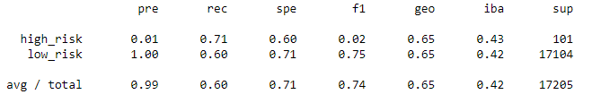
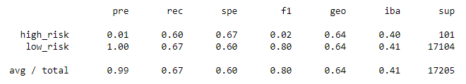
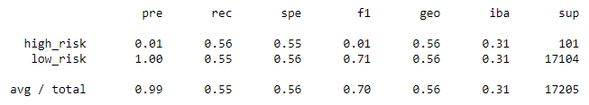
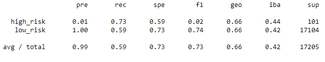
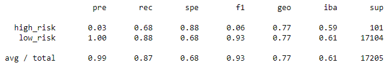
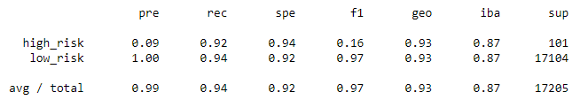

# Credit_Risk_Analysis

## Overview
In this project we worked with Python and the Scikit-learn library to create supervised machine learning models.
We using a dataset of credit card information, we cleaned the data, created train/test sets, and used different models to predict which clients were more likely to default on a loan.

## Results

### Naive Random Oversampling

- The balanced accuracy score was: 0.65
- The precision score for high risk was: 0.01
- The precision score for low risk was: 1.00
- The recall score for high risk was: 0.71
- The recall score for low risk was: 0.60

### SMOTE Oversampling

- The balanced accuracy score was: 0.64
- The precision score for high risk was: 0.01
- The precision score for low risk was: 1.00
- The recall score for high risk was: 0.67
- The recall score for low risk was: 0.60

### Undersampling

- The balanced accuracy score was: 0.56
- The precision score for high risk was: 0.01
- The precision score for low risk was: 1.00
- The recall score for high risk was: 0.56
- The recall score for low risk was: 0.56

### Combination (Over and Under) Sampling

- The balanced accuracy score was: 0.66
- The precision score for high risk was: 0.01
- The precision score for low risk was: 1.00
- The recall score for high risk was: 0.73
- The recall score for low risk was: 0.59

### Balanced Random Forest Classifier

- The balanced accuracy score was: 0.77
- The precision score for high risk was: 0.03
- The precision score for low risk was: 1.00
- The recall score for high risk was: 0.68
- The recall score for low risk was: 0.88

### Easy Ensemble AdaBoost Classifier

- The balanced accuracy score was: 0.93
- The precision score for high risk was: 0.09
- The precision score for low risk was: 1.00
- The recall score for high risk was: 0.92
- The recall score for low risk was: 0.94

## Summary
Based on our results, oversampling and undersampling are ineffective here, at least on their own. Of the techniques used, Easy Ensemble AdaBoost appears to provide the best precision, recall, and accuracy so this is the technique recommended. It is good that both the precision and recall are high for this technique, however recall is more important here because we want to flag potentially fraudulent charges.

